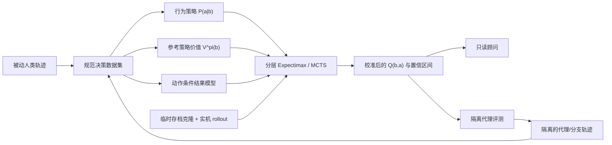

# 《杀戮尖塔 2》预期通关概率与逐决策最优策略计划

- 日期：2026-08-02
- 状态：已评审；记录与文字沙盒基础设施已开始实现，模型训练尚未开始
- 项目根目录：仓库根目录 `hack-sts2/`
- 推荐首期范围：单人、玩家可见信息、固定游戏版本、单角色与单一进阶切片、离线顾问优先

## Goal

在现有被动轨迹记录、规范化数据与 STS2MCP 环境之上，建立一个能回答以下问题的决策系统：

> 给定当前玩家可见状态和全部合法动作，分别选择每个动作之后，最终通关的概率是多少？在统计和模拟误差下，哪个动作最可能提高整局通关率？

这里的“最大化每一步胜率”不是最大化眼前伤害、当前 HP、遗物数或下一场战斗胜率，而是让每一步都服从同一个终局目标：

\[
V^\pi(b_t)=P(\text{最终通关}\mid b_t,\pi)
\]

\[
Q^\pi(b_t,a)=\mathbb{E}_{b_{t+1}\sim P(\cdot\mid b_t,a)}
\left[V^\pi(b_{t+1})\right]
\]

\[
\pi_{k+1}(b_t)=\arg\max_{a\in\mathcal A(b_t)}Q^{\pi_k}(b_t,a)
\]

其中 `b_t` 是依据公开观察历史形成的信念状态，`A(b_t)` 是当前合法动作集合。随机抽牌、奖励、事件、地图和敌人行为进入期望；隐藏抽牌顺序和 RNG 真值不得进入公平策略的特征。

一个重要限制是：胜率永远依赖后续策略。人类轨迹训练出的第一版只能称为 `V^human`，不能直接冒充 `V*`。系统应通过“参考策略评估 → 动作改进 → 新策略回放 → 重新校准”的策略迭代逐步逼近更优值。

## Outcome

完成后应得到以下工件：

1. 一个可版本化的决策数据集：每条记录都包含公开状态、完整合法动作集、实际动作、下一决策状态、来源/分支关系与终局结果。
2. 一个经过独立校准的通关概率模型，输出胜率、置信区间、适用数据切片和分布外警告。
3. 一个行为策略模型，既作为人类打法基线，也作为搜索先验和默认 rollout 策略。
4. 一个隔离的反事实分支评估器，可从同一决策状态复制临时实例，尝试多个动作并用共同随机数比较结果。
5. 一个分层决策器：战斗内使用短视野树搜索，局外选择使用枚举/束搜索；两者共享终局价值函数。
6. 一个只读顾问接口，针对当前状态返回动作排名、预计通关率差值、置信度和关键影响因素；自动操作仅在隔离评测阶段启用。
7. 一套固定种子、版本锁定、按整局分组的回测协议，可证明模型是否真的提高胜率，而不只是拟合历史选择。

建议的最终输出格式：

```json
{
  "state_id": "public-state-hash",
  "policy_version": "pi-003",
  "recommendation": {"action": {"type": "...", "params": {}}, "p_win": 0.284},
  "alternatives": [
    {"action": {"type": "...", "params": {}}, "p_win": 0.251, "delta": -0.033}
  ],
  "interval": [0.247, 0.318],
  "confidence": "medium",
  "ood": false,
  "reasons": ["..."],
  "rollouts": {"count": 256, "effective_seed_pairs": 128}
}
```

数字只在通过校准检查后展示；否则输出排序和宽置信区间，避免伪精确。

## Current Project Baseline

现有代码已经提供关键底座：

- `mod/src/` 被动记录精确动作、公开状态快照和事件，并区分人类与程序化来源。
- `sts2rec/sts2rec/canonical.py` 已将多流合并为 `state_before → action → state_after`，但 v1 的 `reward` 为空，也没有显式 `legal_actions`。
- `CLAUDE.md` 已明确要求从状态离线推导合法动作，而不是让记录器主动影响游戏。
- `sts2rec/sts2rec/env.py` 已有 `observe/step/reset` 和多实例入口；官方引擎驱动的文字 worker 已在 macOS arm64 上完成并发验证。当前硬门槛是精确的战斗中 checkpoint/restore，而不是无头启动本身。
- `scripts/level2_driver.py` 已覆盖主要屏幕类型，里面的状态分派可以作为合法动作枚举的初始对照，而不能直接当作策略质量基线。
- 现有决策复盘 `docs/decision-analysis-JAH6SZDGWT.md` 暴露了候选集缺口：部分卡牌奖励、商店商品身份、选牌覆盖层、休息点和地图候选不完整，且重载分支未显式建模。
- `docs/hook-map.md` 说明原生历史里有被选择与被跳过的卡牌/遗物候选，可用于补齐一部分反事实集合。

因此首要问题不是换更大的模型，而是建立无泄漏、候选完整、分支可追踪的数据契约。

## Target Architecture



### 状态与信息边界

公平模型只使用当时玩家能知道的内容：

- 运行级：角色、进阶、版本、Act/楼层、Boss、当前地图与可见连接。
- 资源级：HP/最大 HP、金币、药水、遗物及计数器、牌组多重集、升级/附魔。
- 战斗级：手牌、能量、公开的抽/弃/消耗牌堆信息、敌人状态/意图、召唤物、Buff/Debuff、回合历史摘要。
- 决策界面：所有可选卡牌、商品、路线、事件/休息选项、目标和跳过/离开动作。

以下信息只能用于诊断或模拟器复现，不能进入公平策略：真实抽牌顺序、未公开 RNG 流、未来地图/奖励、隐藏事件结果。可额外训练一个 `oracle` 模型衡量“隐藏信息上限”，但必须与主模型物理隔离并带泄漏测试。

由于公开状态可能发生别名——相同画面背后的抽牌分布不同——第一版以结构化当前状态加最近决策历史为输入；后续再比较显式概率信念、循环模型和 Transformer 历史编码。

### 两个时间尺度

不建议用一个模型直接吞掉所有决策：

- 战斗内层：`play_card(card_instance, target)`、用/弃药、选牌覆盖层、结束回合。目标是到达战斗后状态的终局继续价值，而不只是少掉 HP。
- 运行外层：走图、奖励、商店连续购买/离开、休息点、事件、宝箱。每个动作通过“下一关键决策或战斗结果分布”连接到终局价值。

外层把一次战斗视为半马尔可夫选项，使用内层策略估计“获胜、掉血、耗药、回合数、战后牌组/遗物变化”的联合分布。这让石中剑、黑星、金字塔一类跨多层生效的选择进入同一个 Bellman 目标。

## Implementation

### Phase 0 — 冻结目标、数据切片和基线协议

目标：在写模型前消除“胜率到底指什么”的歧义。

工作项：

1. 定义首期任务为单人标准模式、玩家可见信息、固定版本、单角色/单进阶；按轨迹数量选择样本最多的切片，若数据量相近则优先当前主要游玩的积咒者 A7。
2. 终局奖励固定为通关 `1`、未通关 `0`；HP、金币、楼层、遗物和战斗胜利只作为辅助预测任务，不能替代优化目标。
3. 定义决策粒度：每次不可撤销输入为一步；商店的购买序列按每次购买和最终离店分别建模；战斗中的目标选择与卡牌选择合并为一个结构化动作。
4. 定义 `policy_version`：每个价值估计必须绑定产生后续动作的参考策略版本。
5. 定义数据切分：以 `seed + run lineage` 为最小分组，再按版本和时间留出；禁止把同一局的不同行随机拆到训练和测试。
6. 建立三个基线：楼层/HP 频率基线、规则启发式、历史人类行为克隆。

验收门：形成一页任务契约和固定评测清单，所有后续实验都能回答“在什么策略、版本、角色、进阶和信息集下，这个概率成立”。

### Phase 1 — 建立候选完整的决策数据集

目标：将现有 canonical trajectory 升级成可训练、可回测、可做反事实比较的决策表。

建议改动范围：

- 在 `sts2rec/sts2rec/` 新增 `legal_actions.py` 与 `decision_dataset.py`，保持记录器被动、`sts2rec` 数据层可复现。
- 将 canonical schema 升级为 v2，在每步 `info` 中加入 `legal_actions`、`decision_type`、`public_state_hash`、`lineage_id` 和候选完整性标记。
- 为每种 `state_type` 建立显式动作枚举器和 golden fixtures。

决策行最少应包含：

```text
decision_id, lineage_id, parent_branch_id, run_id, seed_group,
game_version, character, ascension, policy_source,
observation_history, public_state, legal_actions, chosen_action,
next_public_state, terminal, win, state_complete, candidate_complete
```

具体工作项：

1. 从手牌的 `can_play/target_type/index`、可选敌人、药水和回合状态推导战斗合法动作。
2. 从 `next_options/items/cards/options/relics` 等屏幕块推导走图、奖励、商店、事件、休息和覆盖层合法动作。
3. 把“跳过、离开、确认、取消、结束回合”建成第一类动作；不能只枚举有实体 ID 的选项。
4. 用原生 `CardChoiceHistoryEntry`、奖励前快照或新增被动快照触发器补齐卡牌奖励候选；只有确实无法离线恢复时才改 C# 记录器。
5. 补齐商店商品身份/价格、覆盖层候选、休息点全部选项和地图坐标；无法补齐的旧轨迹标记 `candidate_complete=false`，不用于动作排名训练。
6. 识别存档重载与分叉，建立 `lineage_id/parent_branch_id`；同一母局的多个分支只算一个统计簇，不能伪装成独立样本。
7. 建立来源标签 `human/mcp/search/rollout/autoslay`，任何代理数据不得混入“人类行为”基线。
8. 加入泄漏审计：训练输入字段白名单；测试确保 `events` 中的真实抽牌顺序、seed 解码和未来状态不能到达特征流水线。
9. 生成覆盖率报告：按屏幕类型统计状态完整率、候选完整率、未知动作率、胜负标签率和版本分布。

验收门：在首期支持的屏幕和新鲜验证轨迹上，所有已执行动作都属于推导出的合法动作集；任何不完整状态都显式拒绝训练，不做静默猜测。

### Phase 2 — 先做可校准的监督基线

目标：建立不依赖反事实模拟也能工作的 `V^human` 和人类动作先验。

为避免污染当前 stdlib-only 的 `sts2rec`，建议新增独立 Python 包 `sts2model/`，将 PyTorch、梯度提升、校准和实验依赖放在这里；模型、数据和运行产物写入被忽略的 `artifacts/`。

第一组模型：

1. `V^human(b)`：预测在当前人类后续策略下最终通关概率。
2. `P_human(a|b)`：预测高手在合法动作集合中的选择，作为行为基线和搜索先验。
3. 辅助头：下一战斗是否获胜、HP 损失分布、药水消耗、到达 Act/Boss、剩余楼层；它们只改善表示学习和早期稀疏标签。

推荐模型阶梯：

1. 频率/逻辑回归基线：角色、进阶、Act、楼层、HP 比、金币、牌组大小。
2. 梯度提升模型：数值特征加卡牌/遗物 bag-of-IDs、升级计数、路线统计和战斗摘要。
3. 只有在数据规模证明有收益时，再上集合编码器或历史 Transformer；牌组、遗物、手牌和敌人分别编码后聚合。

训练注意事项：

- 一局会产生大量相关决策行，按局等权或分层采样，防止长局因行数多而主宰损失。
- 胜利样本稀少时使用合适权重，但校准集必须保持真实基准率。
- 单独留出 calibration set，比较逻辑校准、等距/等频分箱和 isotonic；不以单一 ECE 下结论。
- 报告 log loss、Brier score、校准截距/斜率、可靠性图与 bootstrap 置信带；AUROC 只能作为排序辅指标。校准指标本身也可能不稳定，应遵循 [JMLR 的概率校准指标分析](https://www.jmlr.org/papers/v23/22-0658.html)。
- 按角色、进阶、Act、楼层、版本和策略来源做分组校准；跨版本不自动共享概率含义。

验收门：在完全独立的 seed/lineage 测试集上，价值模型相对楼层/HP 基线同时改善 log loss 与 Brier；校准曲线的偏差落在预先报告的置信带内。若做不到，停止进入 RL，先增加数据或修正状态。

### Phase 3 — 验证可重复的反事实分支执行

目标：为同一状态的多个动作产生近似因果、成对可比较的结果，而不是从观察日志猜反事实。

这是风险最高的工程阶段，先做技术验证，再扩大规模：

1. 只在 `headless-instances/` 的临时副本操作；绝不修改玩家真实存档。
2. 在一个关键决策前复制实例存档与必要 RNG 状态，对每个合法动作恢复同一母状态。
3. 用 STS2MCP 执行动作，再由固定 `policy_version` rollout 到战斗结束、下一个宏观决策或整局结束。
4. 对动作之间使用共同随机数/相同 seed 对，减少运气差异；每个样本保存 `root_state_hash`、动作、随机流标识、策略版本和终局。
5. 对同一动作重复恢复，检验状态哈希、奖励候选、抽牌和结果是否可复现；若无法恢复完整隐藏状态，明确改为随机转移估计，不能宣称确定性分支。
6. 用实例池并行 rollout，并实现超时、崩溃恢复、孤儿进程清理与磁盘配额。
7. `scripts/mcp_mod.sh on` 只在代理评测开始时启用，结束后无论成功失败都执行 `off`；人类采集环境始终保持无注入。

验收门：至少覆盖一个战斗动作和一个局外选择，证明从同一根状态恢复后可生成成对分支；重复性、失败率和非确定性来源都有量化报告。若真实无头启动仍不可用，降级为前台隔离实例与离线顾问，暂停搜索阶段，不阻塞 Phase 1–2。

### Phase 4 — 训练动作条件价值并接入分层搜索

目标：从“当前局面大概多少胜率”升级到“每个动作会把胜率改变多少”。

训练对象：

- `Q^pi(b,a)`：动作后沿参考策略继续的终局胜率。
- `A^pi(b,a)=Q^pi(b,a)-V^pi(b)`：动作相对当前参考策略的增益。
- `T(b,a)`：到下一关键状态的结果分布，包含生存、HP、药水和状态变化。

数据优先级：

1. 同根状态、同随机数的实机分支对。
2. 搜索产生的多动作 rollout。
3. 有明确 lineage 的人类重载分支。
4. 纯观察人类轨迹只用于所选动作与行为策略，不把未选择动作虚构成负样本。

搜索设计：

- 候选很少的奖励、遗物、事件和休息点：穷举动作，使用 rollout 均值加校准 leaf value。
- 商店：把购买后的新库存/金币视为新状态，做有限深度束搜索，保留“什么都不买/立即离开”。
- 走图：在公开地图范围做 expectimax/束搜索；未来未知节点是 chance node，不偷看真实未公开结果。
- 战斗：以行为模型作为先验、价值模型作为叶节点评估，做有限预算 MCTS/expectimax；卡牌和目标构成结构化动作。
- 对差距很大的动作提前停止，对接近的候选自适应增加 rollout；当置信区间重叠时返回“近似并列”，不强行给单一答案。

“学习价值 + 树搜索”的组合有成熟先例；MuZero 的核心思想也是只学习规划所需的 reward、policy 与 value，而非完整重建环境，见 [MuZero 论文](https://arxiv.org/abs/1911.08265)。本项目已有真实环境，应优先用实机转移，学习模型用于削减 rollout 成本和估计叶节点。

验收门：在保留的成对分支集上，动作排名的简单遗憾值显著低于行为克隆与规则启发式；在固定计算预算下，增加搜索应呈现稳定的性能—成本曲线。

### Phase 5 — 离线策略评估、概率校准与安全改进

目标：在真实自动游玩前估计新策略是否优于旧策略，并诚实表达无法识别的部分。

1. 直接法：用 `Q/V` 模型估计策略价值。
2. 回放法：在固定 seed suite 上运行候选策略，得到最可信的成对胜率差。
3. 离策略评估：只有行为策略概率和动作覆盖足够时才使用重要性采样；以 doubly robust 估计为辅助，而不是唯一结论。顺序决策中的 DR 方法可参考 [Jiang 与 Li 2016](https://proceedings.mlr.press/v48/jiang16.html)。
4. 置信区间按 seed/lineage 做簇 bootstrap；不得按决策行 bootstrap。
5. 为每个 `policy_version` 重新校准 `V/Q`。策略改变后，旧的 `V^human` 不能继续当作新策略胜率。
6. 建立 coverage/OOD 评分：遇到新版本、新角色、未见牌/遗物组合或候选集缺失时，自动降级为规则/搜索并提示低置信。

可以在该阶段加入 CQL/IQL 等离线 RL 作为实验基线，但必须晚于候选完整性和分支回测。CQL 的保守下界思想专门缓解离线数据对分布外动作的高估，见 [NeurIPS 2020 CQL](https://proceedings.neurips.cc/paper/2020/hash/0d2b2061826a5df3221116a5085a6052-Abstract.html)。它仍不能神奇消除人类选择偏差或缺失候选。

验收门：候选策略在固定版本、固定角色/进阶的成对 seed suite 上相对基线取得正向胜率差，并且置信区间达到预先约定标准；若只改善代理指标而未改善真实胜率，不升级策略版本。

### Phase 6 — 交付顾问，再逐步开放自主代理

目标：将模型变成可验证、可解释、不会污染人类数据的实际决策工具。

第一阶段只读顾问：

- 读取当前公开状态，不注入动作。
- 列出全部合法选项及 `p_win / delta / interval / rollout_count`。
- 给出 2–4 条基于状态差异和敏感性分析的原因，而不是生成式臆测。
- 显示模型版本、游戏版本、训练切片、是否 OOD，以及“数据模型/模拟器/规则”各自贡献。
- 保存建议及玩家最终选择，作为独立 `advisor` 来源，避免把建议后的人类动作混为自然人类基线。

自主代理只在以下条件全满足后启用：动作合法性测试通过、MCP 环境隔离通过、固定 seed 回测优于基线、退出时保证卸载 MCP mod、所有轨迹明确标记为 agent。

验收门：顾问在回放状态上输出稳定、可复现且可解释的排序；代理在隔离实例中连续完成完整运行，无非法动作、状态卡死或人类数据污染。

### Phase 7 — 策略迭代与扩展

每轮遵循固定循环：

1. 用 `pi_k` 收集版本锁定的 rollout。
2. 合并新分支标签并重新训练 `Q^{pi_k}`。
3. 用搜索产生 `pi_{k+1}`。
4. 在未见 seed suite 成对评测。
5. 仅在胜率证据通过门槛后发布，并为 `pi_{k+1}` 重新校准。

扩展顺序建议：同角色相邻进阶 → 同版本其他角色 → 多版本迁移 → 单人通用模型 → 最后才考虑合作模式。每扩一层都保留单切片模型作对照，判断共享表示是否真的有益。

## Evaluation Matrix

| 层级 | 主要指标 | 必须避免的假阳性 |
|---|---|---|
| 数据 | 候选完整率、已选动作合法率、未知状态率、来源纯度 | 只检查记录到的动作，不检查遗漏候选 |
| 胜率模型 | log loss、Brier、校准斜率/截距、可靠性图 | 只看 AUROC；把同一局拆进训练与测试 |
| 动作模型 | 成对简单遗憾、最佳动作命中率、Q 差校准 | 把“高手常选”误当成“选择导致获胜” |
| 搜索 | 固定预算下遗憾、耗时、rollout 故障率 | 用不同随机种子比较两个动作 |
| 策略 | 固定 seed 成对胜率差、95% 簇置信区间 | 只报最好的一批 seed 或混合游戏版本 |
| 系统 | 非法动作率、卡死率、MCP 残留、数据污染 | 代理轨迹被标为人类轨迹 |

辅助指标可以包括 Act 到达率、Boss 到达率、战斗死亡率和计算时间，但最终发布门槛仍是通关率。

## Deferred TODO — Google Cloud x86 运行池

状态：已暂缓；未经用户再次确认，不创建新的计费云资源。

- [x] 在现有 Google Cloud ARM64 控制节点部署 `main` 提交 `9c00679`，建立 Python 环境，并通过 211 个测试。
- [x] 验证现有节点架构边界：节点为 ARM64，而 STS2 官方 Linux 构建要求 `x86_64`；未配置跨架构 Docker，实测返回 `exec format error`。
- [ ] 经用户确认费用后，在配置的 GCP 项目和区域创建独立 x86 Spot worker：初始规格 `e2-standard-4`（4 vCPU / 16 GB）和 50 GB 持久盘。
- [ ] 在新节点上先验证 SteamCMD 匿名取得 Linux depot；若发行权限不允许匿名下载，改用用户合法持有的 Linux 构建，不收集或保存 Steam 密码。
- [ ] 将目前面向 macOS `.app` / APFS overlay 的 provision/launch 脚本扩展为 Linux `x86_64` 共享只读运行时与逐 worker 可写目录。
- [ ] 完成 1/2/4 worker smoke、整局 soak、RSS/磁盘/吞吐测量，以及 Spot 抢占后的轨迹 flush、恢复和闲置自动停机测试。
- [ ] 只有在合法动作审计、版本锁定和真人存档隔离全部通过后，才把云 worker 接入训练或反事实评测。

## User Decisions

以下选择会实质改变实现方向。括号内为推荐默认值：

1. 信息集：玩家可见信息，隐藏真值只做 oracle 诊断（推荐）；或允许读 seed/真实抽牌顺序。
2. 首期切片：按数据量选择单角色、单进阶、单版本（推荐）；或一开始覆盖全部角色/进阶。
3. 产品形态：只读顾问优先（推荐）；或直接做自动代理。
4. 目标函数：纯最大化通关概率（推荐）；或加入低方差/CVaR、娱乐性、速度等次目标。
5. 数据范围：本地人类轨迹加隔离 rollout（推荐）；或纳入外部社区轨迹，后者需要同意、版本和质量治理。
6. 计算预算：快速建议（秒级）、关键决策慢思考（分钟级，推荐双档），或统一固定预算。

若用户暂不选择，按上述推荐默认值执行 Phase 0–3。

## Risks and Assumptions

1. **观察数据不是因果数据。** 高手会在更好的局面选择某些动作，终局胜利不能直接归因于该动作。缓解方式是同根分支、共同随机数和保守 OPE。
2. **胜率依赖后续策略。** `V^human`、`V^search-v1` 不是同一个量。所有预测必须携带 `policy_version`，策略更新后重新估计和校准。
3. **终局标签稀疏且样本相关。** 高进阶胜局少、同局决策高度相关。需要按局等权、分层辅助任务和 seed/lineage 簇置信区间。
4. **公开状态可能不满足马尔可夫性。** 隐藏 RNG 与未记录历史会造成同状态异结果。使用观察历史/信念状态，并把不可约不确定性留在置信区间中。
5. **候选集合缺失会破坏动作学习。** 旧轨迹中不完整的卡牌奖励、商店和覆盖层只能用于状态价值或被排除，不能伪造负选项。
6. **游戏版本快速漂移。** Model ID、存档 schema、MCP 接口和机制都会变化。数据、模型和评测必须锁版本；跨版本采用迁移表和独立校准。
7. **无头运行已验证，但精确存档恢复尚未实机验证。** 若 Phase 3 的 checkpoint/restore 失败，项目仍能交付监督式离线顾问和独立 seeded rollout，但不能声称获得同根状态的精确动作反事实或在线最优策略。
8. **搜索成本可能过高。** 通过行为先验、学习叶值、候选裁剪、自适应采样和战斗/局外分层控制预算。
9. **隐藏信息泄漏会制造虚假高胜率。** 训练字段白名单、oracle 物理隔离、自动泄漏测试和公开状态复盘是发布前硬门槛。
10. **数值会给人过度信任。** 当测试覆盖不足、候选接近或版本外时，系统必须展示宽区间、近似并列或拒绝给概率。

## Suggested Milestones and Effort

粗略按一名工程师、已有轨迹可用估算，不包含为获得足够胜局而持续采集数据的时间：

- M0：任务契约与数据审计，2–3 天。
- M1：合法动作、候选补齐、decision dataset，1–2 周。
- M2：监督价值/行为基线与校准，1 周。
- M3：隔离分支和重复性验证，1–2 周，风险最高。
- M4：Q 模型与分层搜索，1–2 周。
- M5：固定 seed 策略评测与只读顾问，1 周。
- M6：离线 RL、自主策略迭代和跨角色扩展，持续迭代。

最小可用产品是 M0–M2：能对状态给出“参考人类策略下的校准胜率”和候选排序先验。真正能主张“这个动作提高通关率”至少需要完成 M3–M5。

## Execution Gate

本文件只给出计划，不实施代码或修改数据格式。

开始执行前需要确认：

1. 接受推荐首期范围，或明确更换角色/进阶/版本切片。
2. 确认公平信息模型是主目标，隐藏信息只作诊断。
3. 确认先交付只读顾问，再开放隔离自动代理。
4. 确认 Phase 3 允许复制临时无头实例的存档，但绝不修改真实玩家存档。

确认后严格按 Phase 0 → 1 → 2 → 3 的依赖顺序执行；每个验收门失败时先修复该层，不用更复杂的模型掩盖数据或环境问题。
