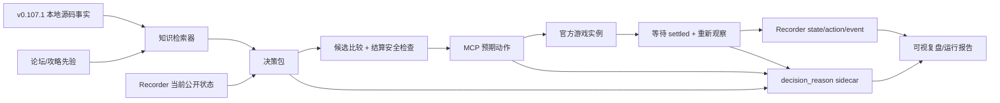

# 骨妹 A9：可视、可审计、知识增强的下一轮通关计划

- 日期：2026-08-07
- 状态：用户已批准并完成 MCP 锁定、隔离可视实例、源码事实库和单动作审计执行器；正式 A9 的每个核心决策必须由外部 LLM 逐状态完成，禁止通用启发式战斗 driver
- 目标版本：稳定版 STS2 `v0.107.1`
- 目标角色与难度：亡灵契约师（骨妹）A9，单人标准模式
- 与既有计划的关系：本计划是下一次实际游玩的短期工程门槛；长期胜率模型仍由 `Plan/2026-08-02-sts2-win-probability-model.md` 负责

## Goal

在再次开局前补齐上一局暴露出的关键缺口，使下一轮 A9 游玩同时满足：

1. 用户能实时看到游戏画面和关键决策理由。
2. 游戏、MCP、Recorder 和知识库均锁定到明确版本。
3. 代理在决策前能检索全部卡牌、遗物、药水、关键词和敌人机制，而不是只按当前文字做局部判断。
4. 每个不可撤销决策都能通过 Recorder 的 `state/action` 与独立的 `decision_reason` 一一对齐。
5. 每次动作后等待游戏真正结算，再重新观察动态意图、状态和候选，避免使用过期 index 或过期伤害数字。
6. 以通关为最终目标，但下一局先按“单局—复盘—再决定是否连开”的节奏运行，不立即连续冲关。

## Outcome

完成本计划后应具备以下工件：

1. **隔离可视 worker**：显示真实游戏窗口，但继续使用独立 HOME、独立存档、独立端口和独立录制目录，不触碰人类主存档。
2. **版本锁定的 MCP 构建**：从上游已支持 v0.107.1 的提交构建，记录源码提交、DLL 哈希、游戏版本与 smoke-test 结果。
3. **可检索的事实知识库**：从本地 v0.107.1 游戏程序集提取卡牌、升级、遗物、药水、关键词、敌人动作和事件描述。
4. **分离的社区先验库**：把攻略、论坛和高进阶经验作为带来源、日期、版本和置信度的“意见”，不与源码事实混在一起。
5. **决策 sidecar**：每个决策保存 state/action 引用、完整候选、预期动作、实际动作、简洁理由、置信度和结算后校验。
6. **动作结算屏障与安全检查**：避免过期状态、移动 index、选择界面瞬时消失以及污染/虚弱等动态伤害变化。
7. **运行前验收报告和运行后复盘报告**：能够回答“为什么选”“实际执行了什么”“是否按预期结算”“哪些备选后来证明更好”。

### 非目标

- 本轮不训练胜率模型，不做离线 RL，也不宣称求出全局最优策略。
- 本轮不切换到 v0.110.0 Beta；Beta 兼容性单独验证。
- 本轮不修改或覆盖用户主存档，不使用读档回滚改变正常败局。
- 本轮不把整份卡池文本永久塞入每次 prompt；使用版本化索引和按需检索。
- 本轮只记录可审计的决策摘要，不要求保存冗长的内部思维链。

## Current Evidence

上一局提供了足够明确的工程证据：

- Recorder 会话完整结束，包含 1,795 个状态、503 个动作、2,759 个事件和原生 replay。
- 最后回合观察先显示感染棱柱 `6×3`；打出两张附带污染3的防御后，污染6令实际意图变为 `12×3`。代理没有在每次动作后重新计算。
- 多数 card reward 只留下 `player_choice.index`，候选界面在两次 poll 之间消失，导致被拒绝的卡牌无法仅靠 Recorder 完整复原。
- 商店动作存在 `item_id:null`，虽可通过前后状态推断买了灯笼和违逆，但动作记录自身不自足。
- MCP 走 UI funnel 的部分操作被 Recorder 标成 `human:true`，不能单靠该字段判断决策来源。
- 实际使用的 MCP 是本地 `0.4.0+v0107` 兼容构建；上游 `main` 已有更新的 v0.107.1 原生兼容提交。
- “血肉戏法、友谊、碎骨、Haunt 等牌的长期价值”没有在开局前形成可靠先验，选牌偏向眼前数值和奥斯提进攻。

## Target Architecture



## Implementation

### Phase 0 — 冻结运行契约与版本

目标：在任何代码变更前明确下一局的公平边界和可复现条件。

1. 固定游戏稳定版 `v0.107.1`、亡灵契约师、A9、单人标准模式。
2. 记录游戏 `release_info.json`、Steam build ID、Recorder 版本、MCP commit/DLL SHA-256、仓库 commit 和配置文件。
3. 玩家可见信息是决策输入；真实抽牌顺序、未来奖励和隐藏 RNG 只可用于事后诊断，不可进入实时决策。
4. 正常败局不读档；若因 MCP 断连、worker 崩溃或 Recorder 不完整而中止，则标为 `infrastructure_invalid`，不当作策略败局。
5. 下一局采用单局评审节奏；完成或失败后先生成复盘，再由用户决定是否继续连开。

验收门：生成一份 preflight 元数据，所有组件版本明确，没有使用 Beta 或未知 DLL。

### Phase 1 — 更新 MCP，并建立隔离可视 worker

目标：让用户看到画面，同时保持测试实例和人类环境物理隔离。

1. 不直接覆盖本地 STS2MCP 工作区；从上游兼容 v0.107.1 的 commit `55e064850a68f3b4cde7e5fd525bf9b2dec4e885` 建立干净构建目录。
2. 构建新的 MCP DLL，记录 commit、构建参数、产物哈希和 API schema。
3. 先在现有无头实例做 GET state、开局、出牌、选牌、商店、结束回合、game-over/reset smoke test。
4. 为 worker launch 增加显式 `--visible` 模式：保留 `--force-steam=off`、独立 HOME/save/mod/recording/port，只移除 Godot `--headless`。
5. 确认只允许一个可视 worker 获取窗口与输入焦点；其他并发实例继续无头或关闭。
6. 启动前和关闭后分别计算人类主存档关键文件的哈希，要求完全不变。
7. 若隔离可视实例在 macOS 上不可行，回退方案才是正常 Steam GUI + 专用游戏 Profile + 启动前备份；不得无提示使用主 Profile。
8. 增加可见的状态/理由观察方式：游戏窗口展示游戏本身，终端或轻量 dashboard 实时 tail 当前 floor、state hash、预期动作和简短理由。

验收门：完成一次 3 层可视 smoke run；用户能看到画面，MCP 能控制，Recorder 完整，人类存档哈希不变。

### Phase 2 — 构建版本化的事实与社区先验知识库

目标：把“知道所有卡牌”从临时阅读变成可更新、可检索、可验证的基础设施。

#### 2.1 源码事实层

从本机合法安装的 v0.107.1 程序集中提取并规范化：

- 全部角色卡、无色卡、诅咒/状态牌、升级前后数值、费用、关键词和生成关系。
- 全部遗物、药水、Ancient、事件选项和奖励类型。
- 全部敌人的动作、A9 数值变化、状态、阶段转换和特殊结算顺序。
- 动态关键词和组合规则，优先覆盖污染、虚弱、易伤、Doom、虚无、灵魂、奥斯提承伤/死亡、能力触发和多段攻击。

推荐存储：

```text
knowledge/
  source/v0.107.1/cards.jsonl
  source/v0.107.1/relics.jsonl
  source/v0.107.1/potions.jsonl
  source/v0.107.1/enemies.jsonl
  source/v0.107.1/keywords.jsonl
  source/v0.107.1/events.jsonl
```

每条记录至少包含稳定 model ID、中英文名、基础/升级描述、结构化效果、来源程序集和游戏版本。

#### 2.2 社区先验层

优先整理亡灵契约师 A8–A10 相关资料：Spire Codex、Steam 讨论、Reddit 高质量长评、高进阶完整录像/指南。每条先验保存：

- 来源 URL、发布日期、适用游戏版本、作者经验声明。
- 单卡基础评价、何时拿、何时不拿、升级优先级。
- 协同和反协同，例如血肉戏法 × Debuff、友谊 × 非力量伤害、碎骨 × 命匣、奥斯提进攻在第二幕的衰减。
- Act/Boss/Elite 针对性，例如感染棱柱对技能牌与污染的惩罚。
- 置信度和争议标签；论坛观点不能覆盖源码事实。

推荐存储：

```text
knowledge/
  priors/v0.107.1/necrobinder/cards.yaml
  priors/v0.107.1/necrobinder/archetypes.yaml
  priors/v0.107.1/necrobinder/matchups.yaml
  priors/v0.107.1/sources.yaml
```

#### 2.3 检索与验证

1. 开局加载角色总体先验、Act 1 需求和 Boss 路线，不加载全部原文。
2. 奖励/商店时检索每个候选的事实、当前牌组协同、Act 风险和社区评价。
3. 战斗开始时检索敌人动作表和特殊机制；遇到未知状态时强制进入慢思考，不凭名字猜。
4. 建立 golden questions，至少验证：血肉戏法有哪些常见触发；污染如何改变三段攻击；友谊的力量损失影响哪些伤害；奥斯提死亡/复活时序；各候选是否随升级改变结论。

验收门：源码事实覆盖率 100%；亡灵契约师卡牌和 A9 常见敌人都有检索结果；golden questions 全部通过人工抽查。

### Phase 3 — 建立完整的决策记录契约

目标：真正交付用户要求的 `state, action, decision_reason`，同时避免复制 Recorder 已经保存的大状态。

推荐 sidecar 每行：

```json
{
  "decision_id": "53AUB269PE-f29-r3-d04",
  "state_ref": {"session_id": "...", "seq": 5003, "hash": "8621a7ef0d7b242c"},
  "decision_type": "combat_action",
  "candidates": ["..."],
  "intended_action": {"type": "play_card", "card_instance_id": "...", "target_id": null},
  "decision_reason": {
    "objective": "存活本回合并保留下一轮输出",
    "summary": "...",
    "mechanics_checked": ["污染", "多段攻击", "奥斯提承伤"],
    "prior_refs": ["source:...", "community:..."],
    "confidence": 0.72
  },
  "actual_action_ref": {"seq": 5014},
  "settled_state_ref": {"seq": 5021, "hash": "..."},
  "postcheck": {"matched_intent": true, "unexpected_changes": []}
}
```

记录粒度：

1. 地图、奖励、商店、事件、休息、遗物、药水选择：每个不可撤销选择一条完整记录。
2. 战斗：每回合先写一条 `turn_plan`，随后每个实际动作写简短理由；重复性动作可引用 turn plan，不能完全省略。
3. 不允许通用启发式脚本代替外部 LLM 选择牌、目标、药水或结束回合；执行器每次只接受一个已经明确决定的动作。
4. 所有理由在执行前写入；执行后的观察只写 `postcheck`，避免把结果倒灌成事前理由。
5. 决策理由使用简短、可审计的战略摘要，不保存冗长自由文本思维链。
6. 候选必须在动作提交前同步快照；不依赖下一次轮询碰巧捕获选择界面。
7. Recorder 增加或补齐：卡牌奖励候选、Power Potion 候选、shop `item_id`、来源 `controller=mcp|human`、预期/实际动作关联。

验收门：fixture 与 smoke run 中 100% 不可撤销决策都有完整候选、理由、实际动作和 settled state；不再只能凭聊天记录猜漏牌。

### Phase 4 — 动作稳定性、结算屏障与战斗安全计算

目标：阻止“决策正确但 index 变了”和“看见6×3却实际吃12×3”两类错误。

1. 为每次动作附带 `expected_state_hash`；若当前状态已变化，MCP 拒绝执行并要求重新观察。
2. 调查并采用真正稳定的卡牌实例标识，不使用会随手牌删除而移动的展示 index。
3. 目标绑定内部稳定 combat identity；敌人死亡或重排后，不自动把旧目标 ID 指向新敌人。
4. MCP 响应返回 requested action、resolved actual action、pre/post hash、执行状态和错误原因。
5. 实现 `await_settled`：等待 action queue 空闲、动画/选择完成、回合阶段稳定，再允许下一次决策。
6. 每次出牌、用药或选择后重新 observe；禁止在一个旧状态上连续推断多个移动 index 的动作。
7. 第一版安全计算器不追求模拟整场战斗，只需准确计算当前回合：
   - 多段攻击和格挡消耗；
   - 虚弱、易伤、力量、污染等逐动作动态变化；
   - 奥斯提的目标、吸收、死亡和复活；
   - 能量、能力、遗物和回合结束触发；
   - 最小/最大可能掉血与是否存在确定性死亡。
8. 当 HP 接近 lethal、机制未知、候选间差距很小或状态包含新敌人/新关键词时进入 `slow_mode`：重新检索机制、枚举合法行动顺序、校验每条线的伤害。
9. 安全计算器输出可解释的算式，并在 settled state 后比较预测与实际；任何差异自动形成回归 fixture。

验收门：污染6 + `6×3` 的 fixture 必须算出 `12×3`；连续移动 hand index 的测试不得误出牌；预测与实际不一致时系统必须停下而不是继续连点。

### Phase 5 — 运行前统一验收

目标：只有所有硬门槛通过，才允许真正开 A9。

#### 基建门槛

- [ ] 可视隔离 worker 能启动、控制、关闭和重启。
- [ ] 人类存档启动前后哈希一致。
- [ ] MCP 来自锁定 commit，API schema 与 DLL 哈希入 manifest。
- [ ] Recorder 会话完整，无 degraded hooks。
- [ ] 候选快照、shop item ID、controller source 和 decision sidecar 均通过 fixture。
- [ ] `await_settled` 和 stale-state rejection 通过压力测试。
- [ ] 3 层 smoke run 中非法动作、预期/实际不一致和遗漏理由均为 0。

#### 知识门槛

- [ ] 所有卡牌、遗物、药水、关键词和 A1–A3 敌人均有 v0.107.1 源码事实记录。
- [ ] 亡灵契约师的卡牌先验、主要构筑和 A9 matchup 可检索。
- [ ] 当前候选牌/遗物若社区存在分歧，会显示分歧而不是伪造共识。
- [ ] 血肉戏法、友谊、碎骨、Haunt、污染、感染棱柱等复盘重点通过人工 spot check。

#### 决策门槛

- [ ] 每个动作前都能列出完整合法候选。
- [ ] 每个动作都有简短、事前的 decision reason。
- [ ] 高风险回合会自动进入 slow mode。
- [ ] 每次动作后都重新观察 settled state。

### Phase 6 — 下一局 A9 运行协议

1. 用户确认开始后，先展示 preflight 摘要与可视窗口。
2. 开局生成一页策略摘要：路线目标、Act 1 生存需求、预期胜利条件、避免过早锁定的 archetype。
3. 地图、卡牌奖励、商店、Elite/Boss 前进行慢思考；普通低风险动作保持简短理由。
4. 牌的评价必须同时回答：当前即时作用、对当前牌组的协同、下一幕需求、Boss/Elite 针对性、未来抽到关键牌时的上限，以及拿牌造成的牌组成本。
5. 遗物和商店不只比较单项价值，还枚举预算内购买组合与“不买/删除”的机会成本。
6. 战斗每回合先做一次伤害/格挡/状态检查，动作后重新结算；不批量发送未经 re-observe 的操作。
7. 所有核心战斗判断均由外部 LLM 负责；`sts2_action_executor.py` 只校验状态、执行单个动作并记录结果，不包含选牌策略。
8. 用户侧保持两种可见信息：游戏画面实时变化；关键选择时显示简短的 state/action/reason。
9. 若出现未知机制、API 候选不全、预期/实际不符或 Recorder 降级，暂停游戏，不把猜测当正常策略继续执行。
10. 正常死亡后不立即重开；先完成 Phase 7。成功通关也完成同样复盘。

### Phase 7 — 单局复盘与是否继续的门槛

每局结束自动生成：

1. 路线、牌组、遗物、药水、HP 和关键战斗时间线。
2. 所有宏观选择及候选比较；标出“当时合理、结果不好”和“事前信息已足够判断错误”。
3. 所有预测/实际不一致、stale action、候选遗漏和 Recorder 警告。
4. 漏拿牌分析必须来自真实候选快照，不从最终牌组倒推臆测。
5. 社区先验命中、冲突和失效情况；必要时更新 prior，但保留旧版本。
6. 失败归因分开报告：策略错误、机制知识不足、计算错误、执行错误、随机波动、基础设施错误。
7. 提议最多 3 个优先改进，不在一次败局后无节制重写整个策略。

继续下一局的推荐门槛：

- 基础设施错误为 0，或已修复并新增回归测试。
- 所有关键候选和理由可复原。
- 用户看过复盘并确认继续；首次增强运行不自动连开。

## Validation Matrix

| 层级 | 指标 | 硬门槛 |
|---|---|---|
| 隔离 | 人类存档写入 | 0 |
| 可见性 | 用户可见窗口与关键理由 | 全程可用 |
| 版本 | 未知/未锁定组件 | 0 |
| 候选 | 不可撤销决策候选完整率 | 100% |
| 决策 | decision reason 覆盖率 | 100% |
| 执行 | intended/actual 不一致 | 0；出现即暂停 |
| 时序 | stale action 或 unsettled 连续动作 | 0 |
| 战斗 | 已知机制的预测/实际差异 | 0；差异必须生成 fixture |
| Recorder | incomplete/degraded 会话 | 0 |
| 策略 | 未检查机制导致的可避免确定性死亡 | 0 |
| 结果 | 骨妹 A9 通关 | 最终目标；单局失败不伪装成基建失败 |

## User Decisions

以下决定会改变实现范围；括号内是推荐默认值：

1. **可视模式**
   - 选择：隔离可视 worker（推荐），或正常 Steam GUI + 专用 Profile。
   - 原因：前者最安全，但需要先验证 macOS 非 headless worker 能正常渲染。

2. **知识覆盖范围**
   - 选择：源码事实覆盖全卡牌/遗物/药水/敌人，社区先验重点整理骨妹 A9（推荐）；或连所有角色打法先验都深度整理。
   - 原因：万花筒等机制会给其他角色卡，因此事实层应该完整；策略先验先聚焦骨妹更有效率。

3. **运行节奏**
   - 选择：下一局结束后先复盘再决定继续（推荐）；或通过验收后连续运行直到胜利。
   - 原因：第一局增强运行本身也是基础设施验收，自动连开会掩盖重复性问题。

4. **游戏分支**
   - 选择：保持稳定版 v0.107.1（推荐）；或升级 Beta 后重新做完整兼容验证。
   - 原因：上游 MCP 当前明确修复的是 v0.107.1，Beta 已到更高版本，机制和 API 都可能漂移。

5. **理由展示密度**
   - 选择：宏观选择完整解释、战斗每回合有计划且每动作一句短理由（推荐）；或每个战斗动作都展开候选比较。
   - 原因：推荐方案保留可审计性，同时避免一局产生大量重复文本。

若用户暂不修改，后续按以上推荐默认值实施。

## Risks and Assumptions

1. **可视隔离 worker 可能暴露 Godot/Steam 初始化差异。** 先做最小 smoke；失败时才使用专用 GUI Profile 回退。
2. **上游 main 继续变化。** 实施时应重新确认 HEAD；一旦开始正式运行，就冻结 commit，不在局中升级。
3. **源码结构化效果比读取描述更难。** 第一版可保留原文和人工结构化关键机制，但不能把未验证的解析结果当真值。
4. **社区观点有版本、水平和样本偏差。** 必须保留来源和争议，不能把 tier list 当规则引擎。
5. **完整知识不等于强策略。** 它能消除“根本不知道有何协同”，但路线、牌组密度和未来概率仍需判断。
6. **当前回合计算器不等于完整游戏模拟器。** 第一阶段只保证可见、确定的即时结算，长期价值仍使用原则和先验。
7. **稳定卡牌/目标 ID 可能需要修改 MCP 协议。** 在确认游戏内部可用标识前，不应仅给展示 index 换名字假装稳定。
8. **Recorder 与 controller 的同步写入可能影响性能。** sidecar 应追加写、可压缩，并把耗时纳入 manifest。
9. **显示理由可能改变操作节奏。** 理由在动作前落盘，但 GUI 展示可以异步，不能阻塞 Godot 主线程。
10. **单局结果方差很大。** 复盘应区分事前错误与结果偏差，不因一次输赢过度更新先验。

## Current Execution Gate

MCP 版本锁定、隔离可视 worker、源码事实导出和无策略的单动作执行器已经实现。正式 A9 前仍需展示 preflight，并确认 Recorder 候选完整性、controller 来源和关键结算回归测试；任何通用启发式战斗 driver 都不满足本计划的执行门槛。
