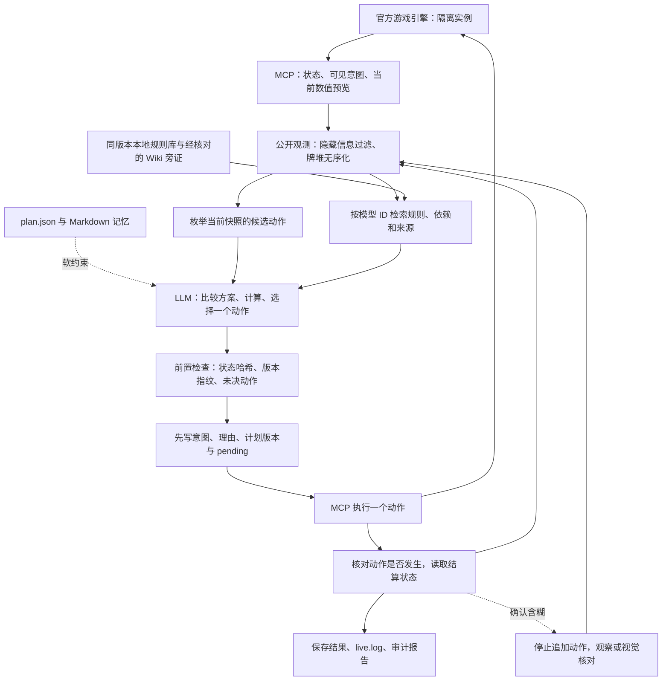
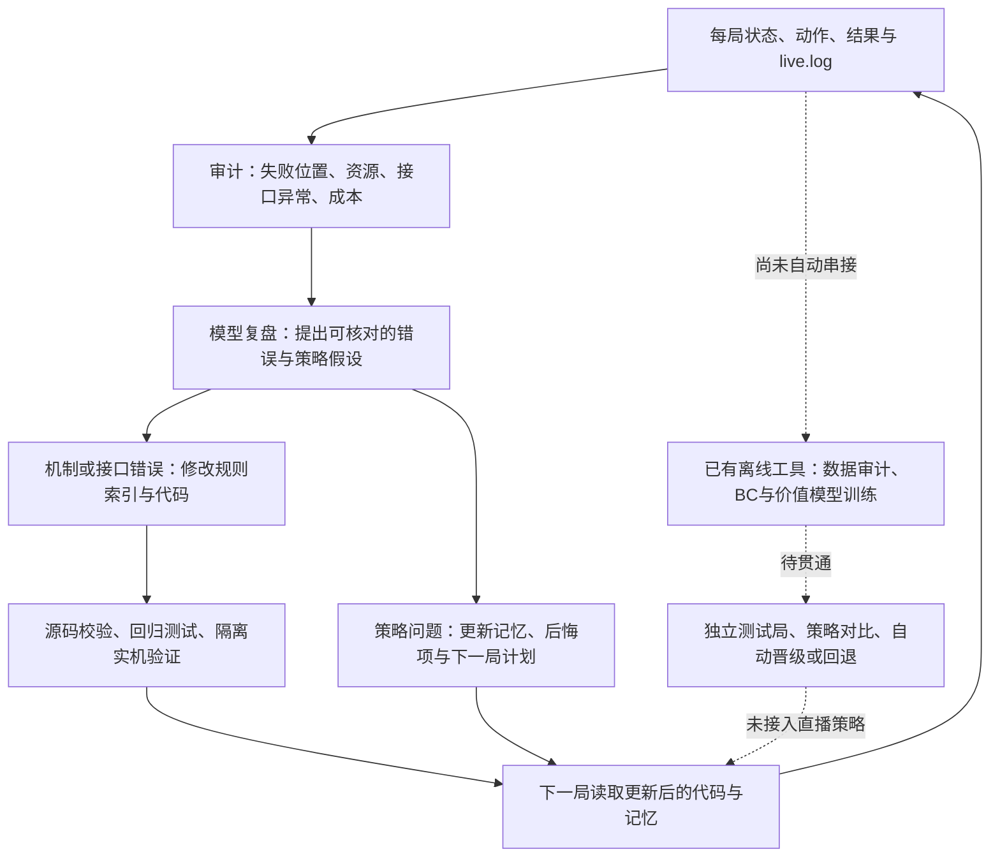

# 直播决策 harness 与改进闭环

核对日期：2026-09-09。描述当前 `scripts/sts2_live.py` 路径。用户要求退出后，原游戏与隔离测试实例均已停止。离线训练工具与直播控制器是不同入口。

## 一次决策的数据流

代码落点：

| 职责 | 当前实现 | 边界 |
|---|---|---|
| 读取真实游戏 | MCP `BuildGameState` 与规则证据补丁 | 引擎数值预览仍有作用域；不能当作整张牌或完整回合模拟 |
| 信息边界 | `sts2rec/information.py` | 移除隐藏字段与实际抽牌堆顺序；公开已知牌顶需要另行跟踪 |
| 动作空间 | `sts2rec/legal_actions.py` | 枚举当前快照可见动作，保留商品/卡牌完整候选；不是所有游戏分支均已实机验证 |
| 知识检索 | `sts2rec/knowledge.py` | 已接入状态、附魔、污染模型及静态依赖；未实现完整规则解释器或自动网页事实更新 |
| 构筑与战斗决策 | 本次对话中的LLM + plan.json + Markdown记忆 | 没有加载训练后的策略网络、胜率Q函数或牌序搜索器 |
| 执行保护 | `scripts/sts2_live.py` | 检查版本、哈希、动作结构、理由与pending；尚未将提交动作逐字段强制匹配到候选集 |
| 动作确认 | `scripts/sts2_action_executor.py` | 动作特定确认 + 稳定等待；完整战斗事件屏障未实现 |
| 审计 | `scripts/sts2_run_audit.py` | 统计动作/奖励/商店/药水/SL/token等；原生历史存在时另核对最终结果与已提交的资源使用 |

计划包含即时威胁、构筑方向、抽牌计划、药水预算和停止条件。harness可以保存这些内容及哈希，也能要求动作理由存在；它无法证明模型读懂了记忆、算式正确或动作符合构筑方向。游戏引擎仍是实际可执行性与结算的裁判。

## Source of truth

当前实例的状态、文本和受支持的引擎预览优先；精确匹配版本、commit与程序集SHA-256的游戏规则用于解释机制；Wiki/Spire Codex是经过核对的补充资料。若游戏指纹缺失、不匹配或相关源码发生变化，直播 `act` 会停止。额外玩法mod对规则的修改仍需单独核对。

现有源库含585张卡牌、127个怪物模型、298个遗物、65种药水；本次补充257个power、23个enchantment、7个affliction模型。模型数包含内部模型，不能当作全部都是玩家可遭遇内容。另有6条经过源码核对的说明：伤害修正顺序、抽牌/洗牌、污染、本能、异蛙寄生虫、沙漏。更多模型可以读源码，但不能据此声称所有机制已经正确实现为计算器。

实机例子：实验体初始攻击22；震荡波作为技能令其增加3力量，再施加虚弱，引擎预览变为 `floor((22+3)×0.75)=18`；与我一战的单段变量因目标易伤由6变为9。两项与事前记录一致。该测试未结束回合，也未证明任何替代牌序能通关。

## 当前 self-improvement

实线表示这次对话可以主动执行的工作流，不代表一个后台任务会自动跑完所有阶段。记忆和代码更新依赖复盘者提出修改；下一局读取记忆与指纹留档。当前没有为直播LLM执行权重训练。

这次真实完成的改进是：发现污染/附魔/意图规则没有进入决策上下文，补上模型关联、来源校验和引擎预览，增加回归测试，再在存档副本检查实际字段。多选及随机预览问题已向上游提交 [issue #133](https://github.com/Gennadiyev/STS2MCP/issues/133)。

策略记忆的证据强度更弱。一次失败后认为某张牌不该拿、某瓶药应留下，只是待验证假设；未重放替代路线时，`counterfactual_tested`必须为false。不能将一次偶然成功写成永久规则。`review.py`的loss是规则诊断代理；`evaluation.py`定义了Q差值接口，但没有为当前直播路径提供经过校准的反事实胜率。

## 仓库已有、尚未接入直播的训练部件

`sts2train dataset build/build-human/audit/split`负责数据与按局切分，`train bc`训练带动作掩码的哈希线性模仿策略，`train value`训练二元胜负价值基线。`benchmark nosl/sl --spec`可以对已经记录的结果校验固定规格、轨迹哈希、读档次数与资源预算。它们是可调用的离线工具，不会由 `sts2_live.py` 自动调用或部署。

尚未贯通的环节包括：直播记录自动转为合格训练数据、完整终局标签在训练环境中的统一、可复现的受控测试局、精确战斗中途反事实分支、候选策略自动比较，以及依据独立测试结果晋级/回退。固定seed注入验证、完整中途clone/restore、在线RL和搜索是计划或接口，不能画成已运行的闭环。

下一步最有价值的是验证策略改动是否有效：为一个错误保留原局面与假设，先做机制回归，再比较多个独立测试局的通关率、失败位置和资源损失。通过之后才把“经验”提升为默认策略；避免只让规则和提示词越来越长。
